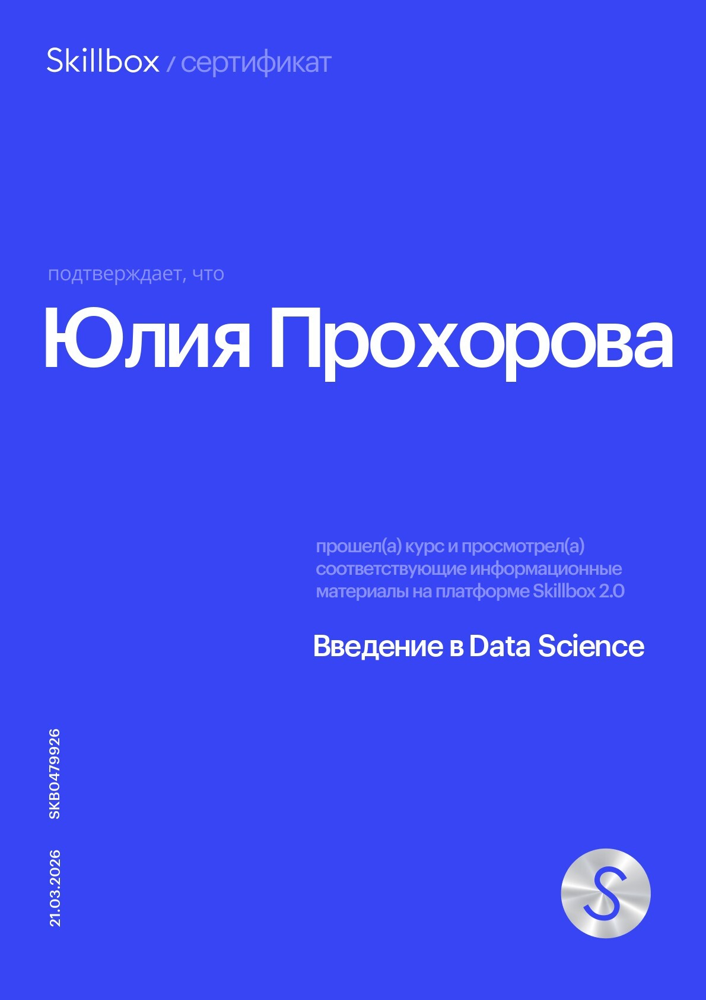
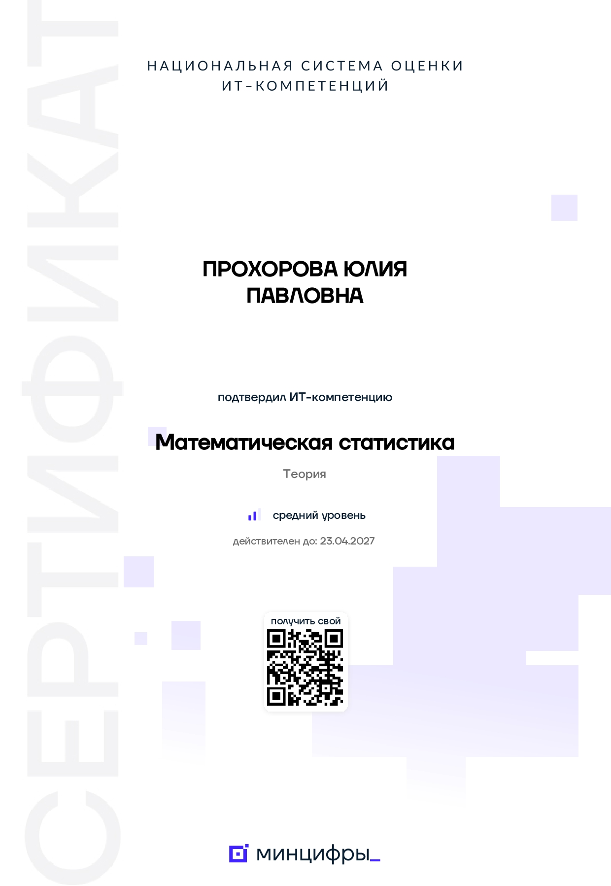

# EDA и проверка маркетинговых гипотез для сервиса «СберАвтоподписка»

## Сертификаты и подтверждение квалификации

Сертификат по математической статистике подтверждён через платформу Национальной системы оценки ИТ-компетенций при поддержке Минцифры РФ.

Все сертификаты, документы и файлы подтверждения доступны по ссылке:

🔗 https://drive.google.com/drive/folders/1S-C4RRe0KDo3VYcOqItpZjX-_lAHJ7Zc?usp=drive_link 

---

## О проекте

Проект выполнен в рамках обучения Data Science и посвящён анализу пользовательского поведения сервиса «СберАвтоподписка».

В ходе работы были выполнены:

- очистка и подготовка данных;
- разведочный анализ данных (EDA);
- расчёт конверсий;
- анализ маркетинговых каналов;
- проверка статистических гипотез;
- формирование продуктовых рекомендаций на основе данных.

---

## Цель исследования

Изучить поведение пользователей на сайте сервиса, определить наиболее эффективные источники трафика и проверить гипотезы о различиях конверсии между группами пользователей.

---

## Использованные навыки

- Python
- Pandas
- NumPy
- Matplotlib
- Seaborn
- SciPy
- Проверка статистических гипотез
- EDA
- Data Cleaning
- Feature Engineering
- Product Analytics
- Conversion Rate Analysis
